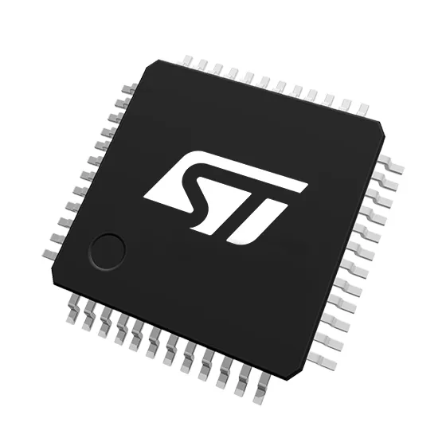
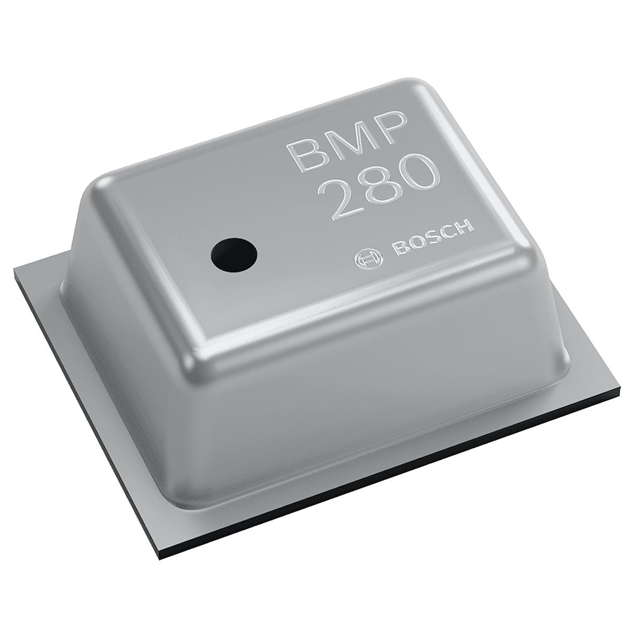
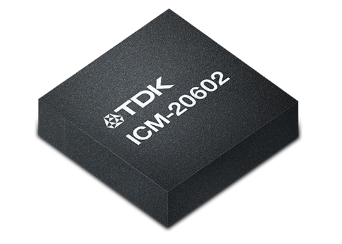
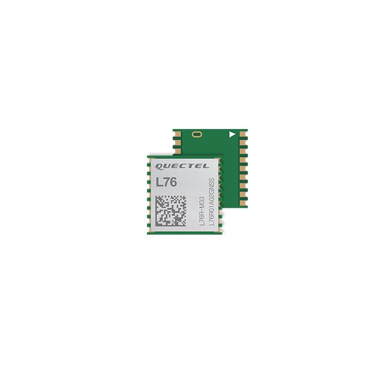
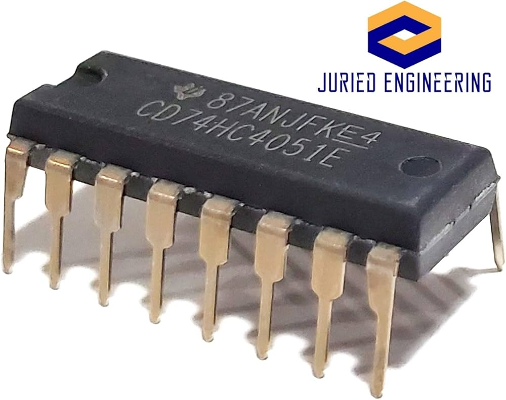
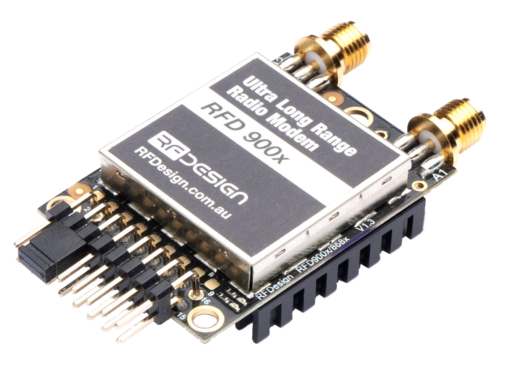
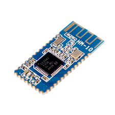
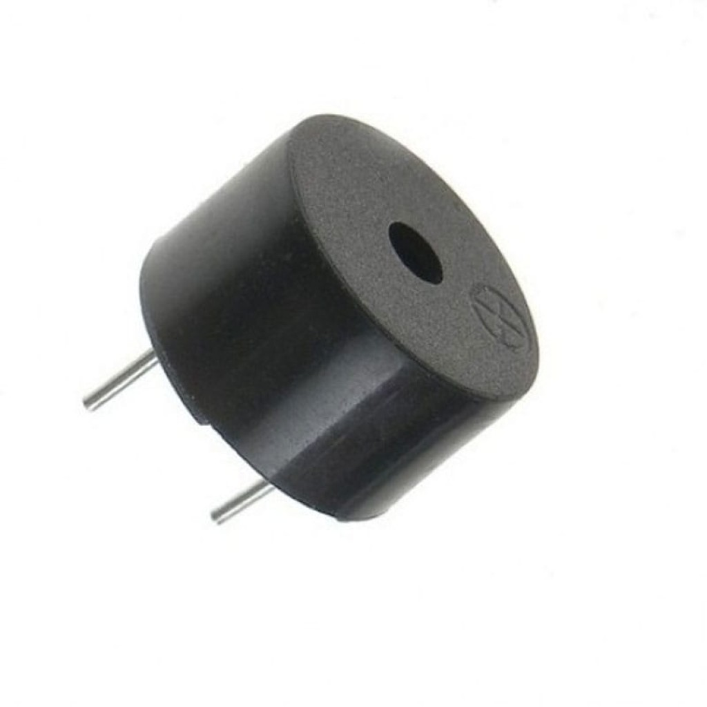

# 🖥️ **Documentation sur les composantes de l'ordinateur de bord**

Cette section présente la description et la liste des composantes utilisées dans la conception de l'ordinateur de bord de la fusée ODB1.

Le [schéma électrique](./Composantes/shematic_v2.pdf) de l'ODB1 donne un aperçu détaillé du câblage et de l'intégration des différents composants.

## **Liste des composantes**

### **MCU - [STM32F103C8](./Composantes/stm32f103c8.pdf)**
Microcontrôleur STM32 utilisé pour gérer l'ensemble des opérations et interagir avec les capteurs et modules.

---

### **Capteur de pression / température - [BMP280](./Composantes/bst-bmp280-ds001.pdf)**
Ce capteur est utilisé pour mesurer la pression atmosphérique et la température. Ces données sont cruciales pour le calcul de l'altitude.

---

### **Capteur d'accélération et de données gyroscopiques - [ICM-20602](./Composantes/DS-000176-ICM-20602-v1.0.pdf)**
L'ICM-20602 permet de mesurer les accélérations linéaires et les rotations angulaires de la fusée sur les trois axes.

---

### **Module GPS - [L76LM33](./Composantes/Quectel_L76_Series_Hardware_Design_V3.1.pdf)**
Le module GPS permet de suivre la position de la fusée en temps réel, fournissant les coordonnées de latitude et de longitude.

---

### **Multiplexeur - [CD74HC4051-EP](./Composantes/cd74hc4051-ep.pdf)**
Le multiplexeur est utilisé pour sélectionner dynamiquement entre plusieurs signaux d'entrée analogiques pour économiser des broches GPIO sur le MCU.

---

### **Lecteur de carte SD - [MEM2067](./Composantes/MEM2067.pdf)**
Le lecteur de carte SD est utilisé pour stocker les données de vol enregistrées par les capteurs.

---

### **Module Radio - [RFD900x](./Composantes/RFD900x%20DataSheet%20V1.2.pdf)**
Ce module permet de transmettre les données de télémétrie en temps réel à la station au sol.

---

### **Igniters**
Les igniters sont utilisés pour déclencher les charges pyrotechniques nécessaires à l'activation des parachutes pendant la descente.

---

### **Module Bluetooth - [HM10_BLE](./Composantes/11.%20HM10%20BLE_FTDI.pdf)**
Ce module Bluetooth est utilisé pour la communication à courte portée, permettant la configuration et le diagnostic de la fusée.

---

### **Buzzer - [GT-0930RP2](./Composantes/GT-0930RP2-14-Feb-2019.pdf)**
Le buzzer est utilisé pour les alertes sonores, telles que les notifications d'erreurs ou d'état de la fusée.

---

### **LED RGB**
La LED RGB est utilisée pour indiquer différents états de la fusée à travers des signaux lumineux.

---

### **Module de connexion pour batterie Li - [MAX1898](./Composantes/max1898.pdf)**
Ce module permet de charger et de gérer la batterie Li utilisée pour alimenter l'ODB.

---

### **Bouton poussoir - [LTC2954](./Composantes/2954fb.pdf)**
Le bouton poussoir permet de démarrer ou d'arrêter manuellement certaines fonctions de l'ordinateur de bord.

---

La liste des autres composantes et leurs documentations techniques se trouvent [ici](./Composantes/).

---

🔙 Retour à la [page principale](../README.md).
