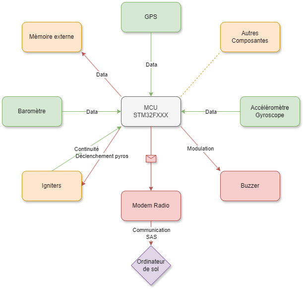
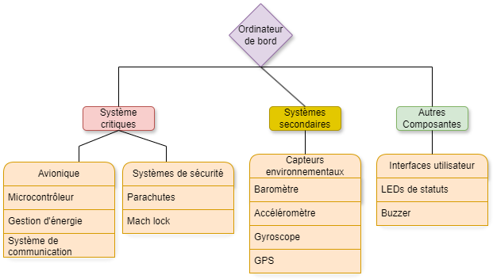
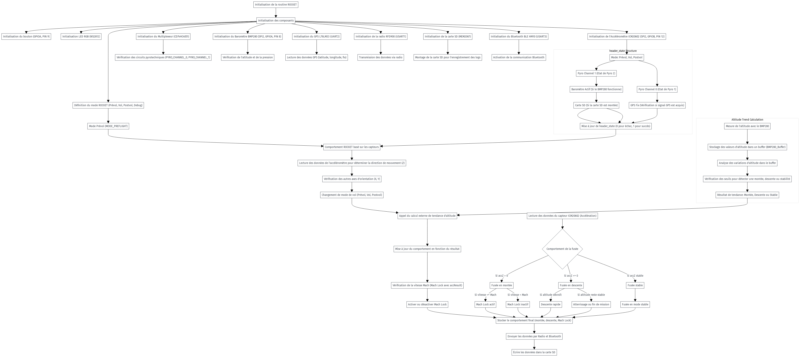

# 🛰️ **Explication de l'Ordinateur de Bord**

Ce document décrit le fonctionnement du code de l'ODB1 utilisé pour la fusée du GAUL.

## 🌳 **Diagramme d'implémentation**

Voici le diagramme qui montre les liaisons entre les différents modules de l'ordinateur de bord:

<div align="center"; style="display: flex; justify-content: space-around;">
  
</div>

</div>

Le diagramme suivant offre une vue d'ensemble des composants clés de l'ODB ainsi que leur rôle dans l'architecture globale:

<div align="center"; style="display: flex; justify-content: space-around;">
  
</div>
  
## 🛠️ **Données principales**

Voici les différentes variables suivies par l'ordinateur de bord pendant le vol:

```bash
- header.flightmode        : Mode de vol (toujours 01)
- header.pyro0             : 0 (igniters non connecté -> 0 sinon 1)
- header.pyro1             : 0 (igniters non connecté -> 0 sinon 1)
- header.accelerometer     : 0 si erreur avec l'ICM à l'initialisation, sinon 1
- header.barometer         : 0 si erreur avec le baromètre à l'initialisation, sinon 1
- header.gps_fix           : 1 si GPS a un fix avec les satellites
- header.sd                : 0 si erreur avec la carte SD à l'initialisation, sinon 1

- altitude_filtered (m)    : Altitude filtrée (float)
- temperature (°C)         : Température interne (float)
- latitude (°)             : Latitude (float)
- longitude (°)            : Longitude (float)
- gyroX (deg/s)            : Vitesse de rotation sur l'axe X (float)
- gyroY (deg/s)            : Vitesse de rotation sur l'axe Y (float)
- gyroZ (deg/s)            : Vitesse de rotation sur l'axe Z (float)
- accX (G)                 : Accélération sur l'axe X (float)
- accY (G)                 : Accélération sur l'axe Y (float)
- accZ (G)                 : Accélération sur l'axe Z (float)
- angle_roll_acc (°)       : Angle de roulis (yaw) (float)
- angle_pitch_acc (°)      : Angle de tangage (pitch) (float)
```

## ⚙️ **Fonctionnement**

### **Accéléromètre**
L'accéléromètre est utilisé pour déterminer le mouvement de la fusée et son orientation en temps réel sur les trois axes (X, Y, Z).

### **Baromètre**
Le baromètre est utilisé pour déterminer si la fusée est en montée ou en descente. Il mesure également la température intérieure de la fusée. Lorsque la fusée dépasse une certaine vitesse, un **Mach lock** logiciel est activé, désactivant le baromètre pendant la phase supersonique. 

### **Mach Lock** 
Un Mach lock pour une fusée est une fonctionnalité de sécurité utilisée dans le système de contrôle de vol. Le terme "Mach" fait référence au nombre de Mach, qui mesure la vitesse par rapport à la vitesse du son. Le Mach lock est activé lorsque la fusée dépasse une certaine vitesse supersonique (généralement à Mach 1 ou plus) et désactive certains modules ou commandes implémentées dans le système. Cela permet de **prévenir les erreurs de mesure** dans les cas où des capteurs sont moins fiables à haute vitesse en raison des turbulences ou de la chaleur extrême. Le Mach lock permet d'éviter l'utilisation de ces données à ce moment critique et ainsi, limiter les comportements inattendus du système. Une fois que la fusée redescend sous une certaine **vitesse** (inférieure au nombre de Mach défini), le lock peut être désactivé, permettant à nouveau l'utilisation des commandes et des capteurs concernés.

### **Déclenchement des charges pyrotechniques**
- **Pyro0 (Drogue chute)** : Déclenché à l'apogée lorsque la fusée commence sa descente.
- **Pyro1 (Main chute)** : Déclenché à basse altitude pour ralentir la fusée avant l'atterrissage.

Ce diagramme fonctionnel offre une vue d'ensemble des comportements essentiels de la fusée. Bien qu'il ne soit pas exhaustif, il illustre clairement les principales interactions et processus impliqués dans le fonctionnement du système.

<div align="center" style="display: flex; justify-content: space-around;">
  <a href="./Explications/Diagramme_Fonctionnel.png" target="_blank">
    
  </a>
</div>

## 📄 **Documentation complémentaire**
- [Composantes](./Composantes.md) : Détails sur les composantes matérielles utilisées.
- [Drivers](./Drivers.md) : Explications du code des drivers logiciels.

## 🪂 **Informations sur les parachutes**

### **Drogue Chute**
Le **drogue chute** est un petit parachute qui est déployé à l'apogée pour stabiliser la fusée pendant la descente pour éviter trop de dérive à cause des vents en haute altitude.

### **Main Chute**
Le **parachute principal** est déployé à basse altitude pour garantir un atterrissage en douceur et en toute sécurisé près du site de lancement.

## 📘 **Références**
- Explication du Mach Lock - Définition générale et contexte: [lien](https://fr.wikipedia.org/wiki/Nombre_de_Mach)
- Effets de la vitesse supersonique sur les capteurs embarqués: [lien](https://www.grc.nasa.gov/www/k-12/airplane/mach.html)
- Détection d'Apogee avec filtre de Kalman pour ordinateur de vol : [lien](./Explications/DetectionApogeewithKalmanFilter.pdf)
---

🔙 Retour à la [page principale](../README.md)
