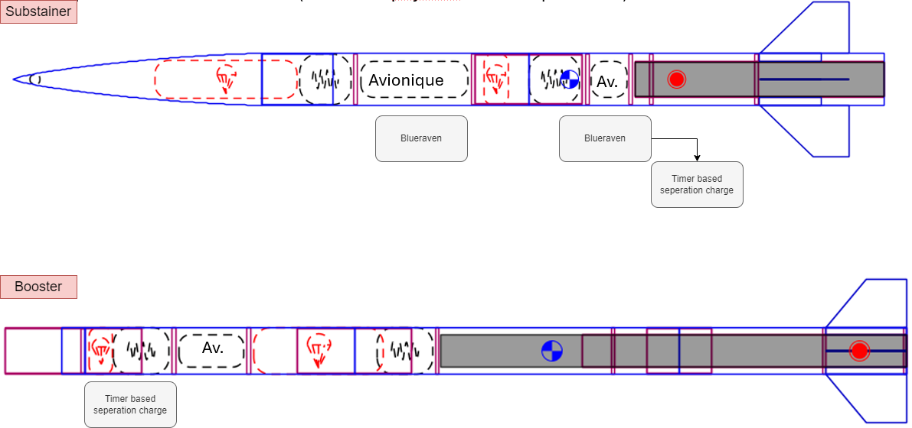
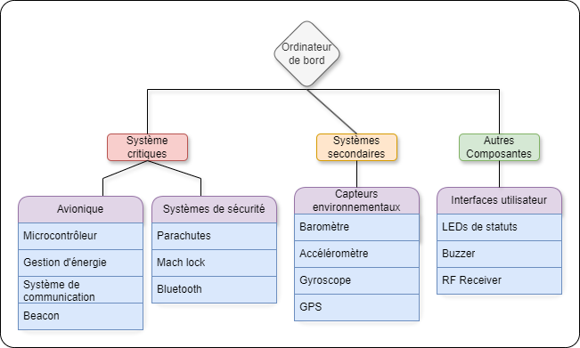
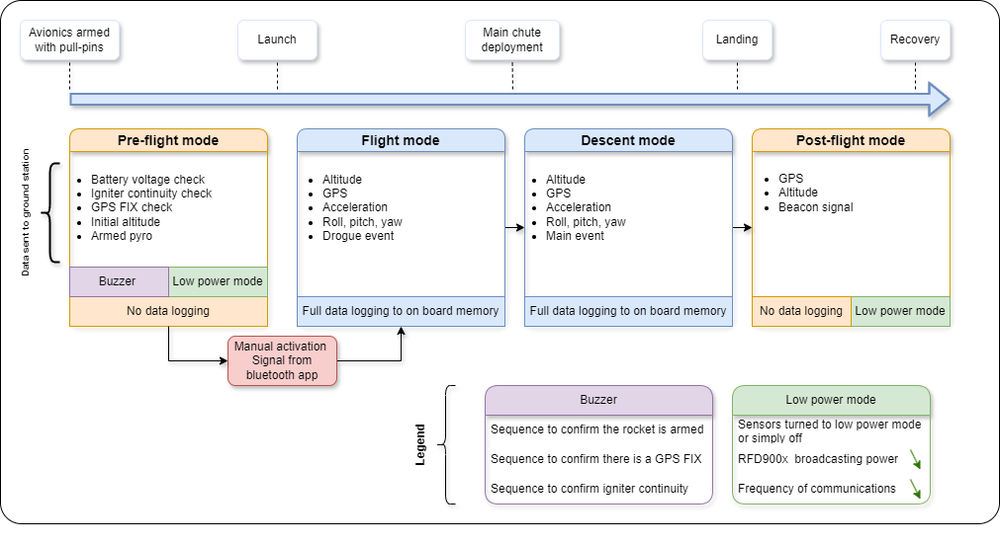
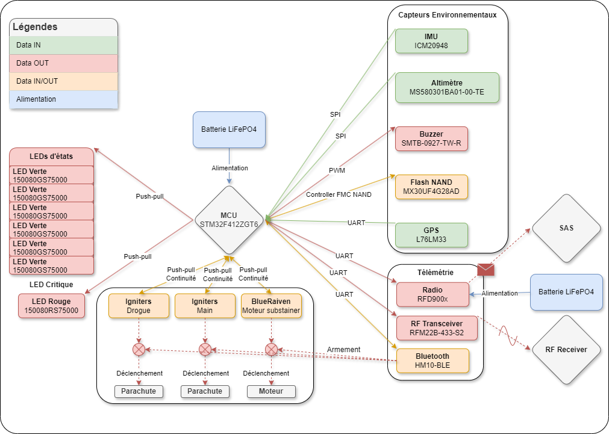

# 🛰️ **Explication de l'Ordinateur de bord**

Ce document décrit le fonctionnement du code de l'ODB2 utilisé pour la fusée du GAUL.

## 🌳 **Diagramme d'implémentation**

Voici le diagramme qui montre la division de l'avionique à travers le **Booster** et le **Substainer** de la fusée:

<div align="center"; style="display: flex; justify-content: space-around;">
  
</div>

Celui-ci donne une vue sur les différentes fonctionnalitées que l'ordinateur de bord doit et peut gérer:

<div align="center" style="display: flex; justify-content: space-around;">
  
  
</div>

Le diagramme suivant offre une vue d'ensemble des composants clés de l'ODB ainsi que leur rôle dans l'architecture globale:

<div align="center"; style="display: flex; justify-content: space-around;">
  
</div>
  
## 🛠️ **Données principales**

Voici les différentes variables à suivre par l'ordinateur de bord pendant le vol:

```bash
...
```

## ⚙️ **Fonctionnement**

### **Accéléromètre**
L'accéléromètre est utilisé pour déterminer le mouvement de la fusée, sa vitesse angulaire et son orientation magnétique en temps réel sur les trois axes (X, Y, Z).

### **Altimètre**
Le baromètre est utilisé pour déterminer si la fusée est en montée ou en descente. Il mesure également la température intérieure de la fusée pour calibrer les mesures barométriques. Lorsque la fusée dépasse une certaine vitesse, un **Mach lock** logiciel est activé, désactivant l'altimètre pendant la phase supersonique. 

### **Mach Lock** 
Un Mach lock pour une fusée est une fonctionnalité de sécurité utilisée dans le système de contrôle de vol. Le terme "Mach" fait référence au nombre de Mach, qui mesure la vitesse par rapport à la vitesse du son. Le Mach lock est activé lorsque la fusée dépasse une certaine vitesse supersonique (généralement à Mach 1 ou plus) et désactive certains modules ou commandes implémentées dans le système. Cela permet de **prévenir les erreurs de mesure** dans les cas où des capteurs sont moins fiables à haute vitesse en raison des turbulences ou de la chaleur extrême. Le Mach lock permet d'éviter l'utilisation de ces données à ce moment critique et ainsi, limiter les comportements inattendus du système. Une fois que la fusée redescend sous une certaine **vitesse** (inférieure au nombre de Mach défini), le lock peut être désactivé, permettant à nouveau l'utilisation des commandes et des capteurs concernés.

### **GPS**
Le module GPS est utilisé pour suivre la position en temps réel de la fusée pendant son vol. Il permet de déterminer les coordonnées exactes de la fusée, sa vitesse horizontale et verticale, ainsi que sa trajectoire. Ces informations sont cruciales pour la télémétrie en direct et les calculs de récupération post-vol.

### **Mémoire Flash**
Le module GPS est utilisé pour suivre la position en temps réel de la fusée pendant son vol. Il permet de déterminer les coordonnées exactes de la fusée, sa vitesse horizontale et verticale, ainsi que sa trajectoire. Ces informations sont cruciales pour la télémétrie en direct et les calculs de récupération post-vol.

### **Buzzer**
Le buzzer est utilisé comme signal sonore pour indiquer différents états ou événements pendant la préparation du vol ou juste après l'atterrissage. Il peut, par exemple, émettre des sons pour signaler un problème de capteur ou le succès d'une phase critique comme l'activation des parachutes.

### **Radio**
Le module radio permet la transmission des données en temps réel entre la fusée et la station au sol. Cette communication est essentielle pour recevoir des informations sur l'état de la fusée pendant le vol, comme la vitesse, l'altitude, et les événements critiques tels que la séparation des étages ou le déploiement des parachutes.

### **Balise**
La balise est utilisée pour la récupération de la fusée après son atterrissage. Elle émet un signal permettant à l'équipe au sol de localiser la fusée, même si elle a atterri dans une zone éloignée ou difficile d'accès.

### **Bluetooth**
Le module Bluetooth permet une communication à courte distance entre l'ordinateur de bord et un dispositif mobile pour vérifier les systèmes avant le lancement. Il est utilisé pour tester le bon fonctionnement des capteurs et des déclencheurs pyrotechniques avant l'envol ainsi qu'à armer ceux-ci.

### **Igniters**
Les igniters (ou allumeurs) sont utilisés pour déclencher les charges pour la propulsion de la fusée ainsi la séparation des différentes sections nécessaires au déploiement des parachutes. Ils sont contrôlés par l'ordinateur de bord selon les phases critiques du vol, comme l'allumage du moteur du **Substainer** après la séparation du **Booster**.

### **Déclenchement des charges pyrotechniques**
- **Pyro0 (Substainer motor)** : Déclenché à l'apogée du **Booster** pour effectuer la séparation du **Substainer** et déclencher la charge de son propulseur.
- **Pyro1 (Drogue chute)** : Déclenché à l'apogée lorsque la fusée commence sa descente.
- **Pyro2 (Main chute)** : Déclenché à basse altitude pour ralentir la fusée avant l'atterrissage.

## 📄 **Documentation complémentaire**
- [Composantes](./Composantes.md) : Détails sur les composantes matérielles utilisées.
- [Drivers](./Drivers.md) : Explications du code des drivers logiciels.

## 🪂 **Informations sur les parachutes**

### **Drogue Chute**
Le **drogue chute** est un petit parachute qui est déployé à l'apogée pour stabiliser la fusée pendant la descente pour éviter trop de dérive à cause des vents en haute altitude.

### **Main Chute**
Le **parachute principal** est déployé à basse altitude pour garantir un atterrissage en douceur et en toute sécurisé près du site de lancement.

## 📘 **Références**
- Explication du Mach Lock - Définition générale et contexte: [lien](https://fr.wikipedia.org/wiki/Nombre_de_Mach)
- Effets de la vitesse supersonique sur les capteurs embarqués: [lien](https://www.grc.nasa.gov/www/k-12/airplane/mach.html)
- Détection d'Apogee avec filtre de Kalman pour ordinateur de vol : [lien](./Explications/DetectionApogeewithKalmanFilter.pdf)
---

🔙 Retour à la [page principale](../../README.md)
