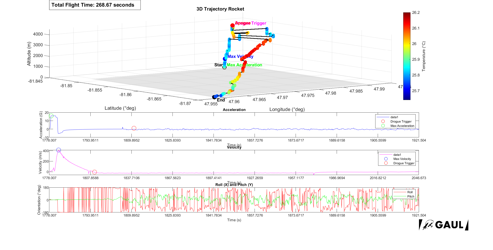

# 🚀 **Showcase de l'Ordinateur de bord**

## **PCB de l'ordinateur de bord**

## **Interface de l'éditeur STM32CubeIDE**

## **Programmation du MCU STM32F103C8**

## **Résultats Ccmpilés de la première itération (ODB1)**
Voici les résultats compilés de la première itération de l'ordinateur de bord [ODB1](https://github.com/GAULAvionique2023-2024/ODB1_Firmware):

Voici le lien Matlab pour visualiser la [Figure](./Showcase/ODB1_Data.fig) 3D de l'analyse.
<a href="./Showcase/ODB1_Data.fig" download="ODB1_Data.fig">📥 Télécharger la figure 3D (.fig)</a>

---

🔙 Retour à la [page principale](../README.md)
